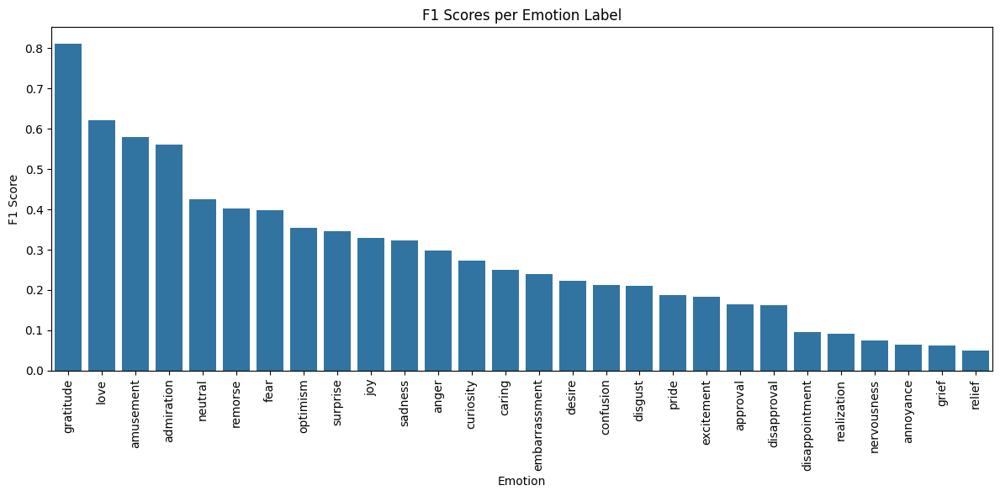
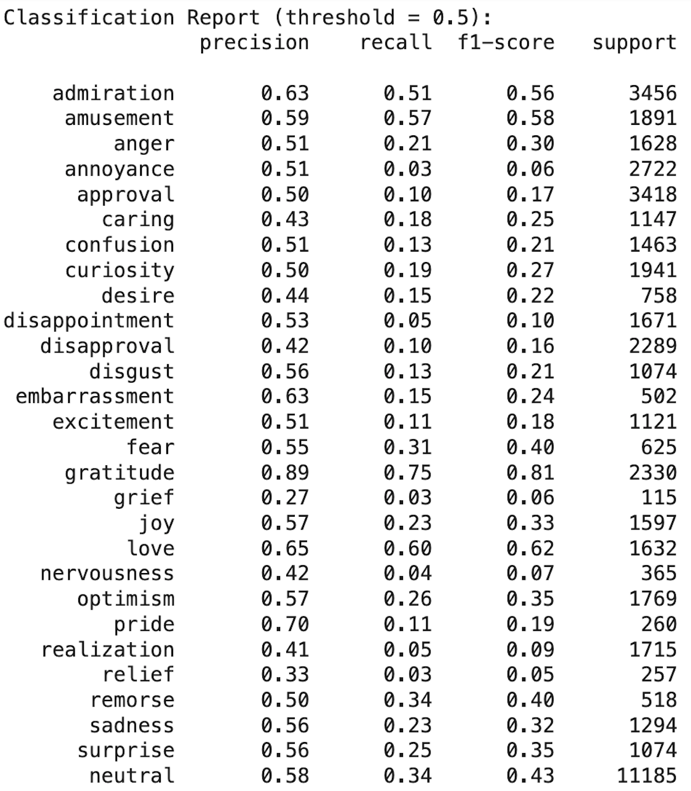

# Emotion Classification with DistilBERT on GoEmotions

This project demonstrates a **multi-label emotion classification** system using the [GoEmotions](https://github.com/google-research/goemotions) dataset from Google and a fine-tuned `DistilBERT` transformer model.

BERT (Bidirectional Encoder Representations from Transformers) is a deep learning model developed by Google in 2018 that significantly advanced the field of Natural Language Processing (NLP). It is based on the Transformer architecture and is pretrained on a large text corpus using two tasks: Masked Language Modeling (MLM) and Next Sentence Prediction (NSP).

The key innovation in BERT is that it reads text bidirectionally, meaning it considers the full context of a word by looking at both its left and right sides simultaneously. This allows BERT to generate highly contextualized word embeddings and achieve state-of-the-art performance on a wide range of NLP tasks such as sentiment analysis, question answering, and text classification.


DistilBERT is a compressed version of BERT created by Hugging Face. It uses a technique called knowledge distillation, where a smaller model (student) learns to replicate the behavior of a larger model (teacher – in this case, BERT).

DistilBERT keeps 97% of BERT's performance while being:

- 40% smaller

- 60% faster

- Much more efficient to deploy, especially in resource-constrained environments

It reduces the number of layers, making it ideal for scenarios where latency and resource usage matter—like real-time APIs or mobile apps. 

I chose to use DistilBERT over the original BERT model primarily due to practical constraints and the nature of this project. This was a personal project that I developed independently over a short period of time, without access to high-performance computing resources like GPUs. I ran all training and inference on my local CPU, and using the full BERT model would have been computationally too expensive and time-consuming.

This project is structured as a **modular Python package**. You can run the entire training and evaluation pipeline with a single command:

```bash
python main.py
```
---

## Project Overview

- **Task**: This project is a multi-label emotion classification task using the GoEmotions dataset released by Google Research. The goal is to develop a model that can identify one or more emotions expressed in a single piece of text (e.g., a Reddit comment).
- **Model**: `DistilBERT` (`distilbert-base-uncased`) with a multi-label classification head.
- **Dataset**: GoEmotions – 58k+ Reddit comments annotated with fine-grained emotions.

---

## Pipeline Summary

1. **Data Loading**: Merged and sampled 20% of GoEmotions dataset.
2. **Preprocessing**: One-hot encoding of 29 labels, tokenizer with truncation and padding.
3. **Model Architecture**:
   - Transformer: `DistilBERT`
   - Loss: `BCEWithLogitsLoss` (multi-label)
4. **Training**:
   - Optimizer: `AdamW`, learning rate: 5e-5
   - Epochs: 3
   - Device: CPU/GPU (Auto-detect)
5. **Evaluation**: Used threshold = 0.5, computed precision, recall, F1 score, and plotted visual summary.


---

## F1 Score Visualization

This chart shows the F1 score per emotion label:



We can observe that the model performs well on high-signal emotions like **gratitude**, **love**, and **amusement**, 
while struggling with rare or subtle emotions such as **relief**, **nervousness**, and **grief**.

---

## Output Files

- `distilbert_goemotions_multilabel.pt`: Trained model weights.
- `emotion_classification_report.csv`: Per-label precision, recall, F1, and support.
- `overall_metrics.json`: Macro, micro, sample-averaged F1 scores.
- `f1_scores_barplot.png`: F1 score bar chart for each emotion class.

---

## Classification Report

Below is the full classification report after training for 3 epochs:



---

## Conclusion

The model performs relatively well on frequent or strongly expressed emotions, such as:

- **gratitude**: F1 = 0.81 (Precision: 0.89, Recall: 0.75)

- **love**: F1 = 0.62

- **amusement** and **admiration**: F1 ≈ 0.56–0.58

These results indicate that the model is capable of learning and detecting clear and commonly occurring emotional signals in text. 
However, the model struggles significantly on rare or subtle emotions, such as **grief**, **nervousness**, **realization**, and **pride**,
with F1-scores near or equal to 0.10–0.20. There are several reasons that can explain this. 

Firstly, training data size for such categories is small. 
This project was built on limited hardware (CPU only), without access to a GPU. Due to computational constraints, I used only 20% of one of the three available GoEmotions CSVs, resulting in ~4,225 training samples. (Epochs: 3, Batch Size: 8)
It setups prioritizes feasibility over completeness, which naturally limits model generalization—especially for low-frequency classes.

Secondly, the recall rate is very small for rare emotions, meaning the model rarely identifies these emotions correctly. 
Besides, there is class imbalance in the original dataset.

Despite hardware limitations and a small training subset, the model achieved strong results on major emotion categories. Accoring to Google GoEmotions official report, the BERT-based model achieves an average F1-score of .46 across their proposed taxonomy based on the whole three available data set. 
With access to more data and compute, I am confident that performance—especially on rare emotion classes—can be significantly improved through proper fine-tuning, threshold calibration, and training on the full dataset.


---

## Next Steps

If given access to more computational resources, I would take the following steps to improve model performance, especially on rare emotions:

1. Use Full Dataset 
   - Train on the full GoEmotions dataset (≈58,000 samples) to expose the model to more emotion diversity. 
   - This would significantly improve representation of rare labels.

2. Train for More Epochs 
   - Increase training epochs from 3 to 5–10 to allow better convergence. 
   - Especially valuable when using a small learning rate.

3. Fine-Tuning Strategies
To further boost performance, especially for rare emotions, I would apply:
   - Class-weighted loss function (e.g., `pos_weight` in `BCEWithLogitsLoss`) to penalize the model more when rare labels are missed. 
   - Threshold tuning: Adjusting decision thresholds per label based on validation F1 or precision-recall tradeoffs. 
   - Gradient accumulation: to simulate larger batch sizes on CPU without exceeding memory. 
   - Data augmentation: Paraphrasing or back-translation to synthetically increase diversity of minority emotion expressions.
   - Additionally, hyperparameter tuning (learning rate, number of epochs, batch size, tokenizer max length) can be performed using grid search. Due to computational constraints, the grid search logic has been modularized and included in `demo.py` for future experimentation.

4. Model Alternatives
Consider using **bert-base-uncased** or **roberta-base** when GPU is available to capture deeper semantic representations.


This emotion classification model can be adapted to analyze financial news, social media streams, or analyst commentary 
to extract fine-grained sentiment signals. These signals can be used as alternative data features to improve predictive models for asset returns, volatility forecasting, and event-driven trading strategies. Additionally, integrating emotional tone into automated reporting pipelines can enhance the interpretability and relevance of client-facing insights.
